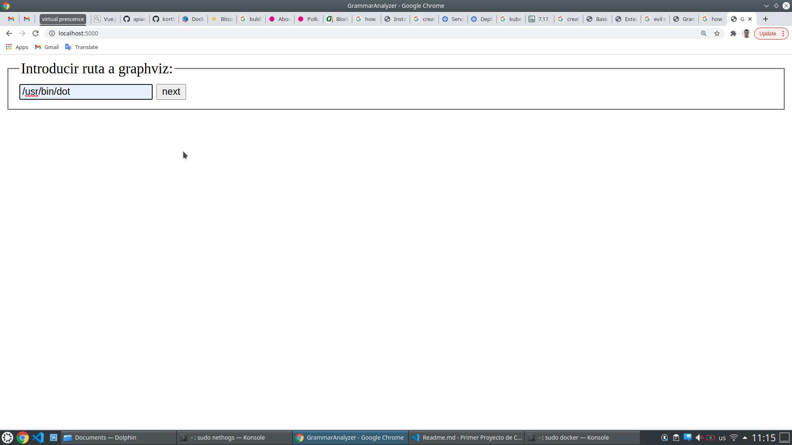
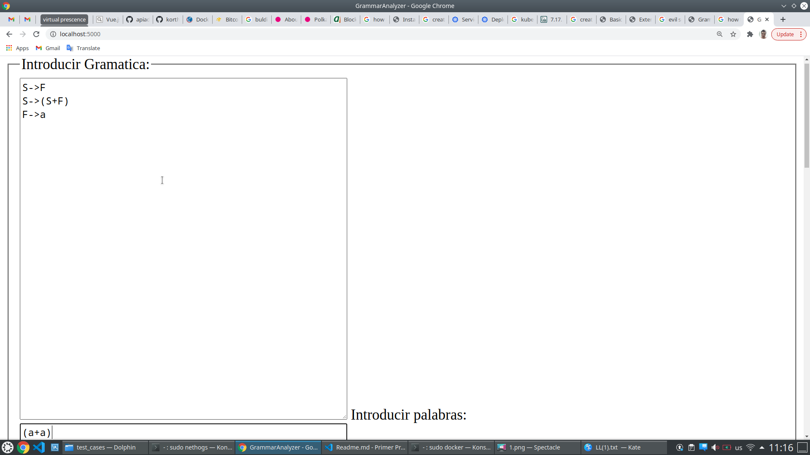
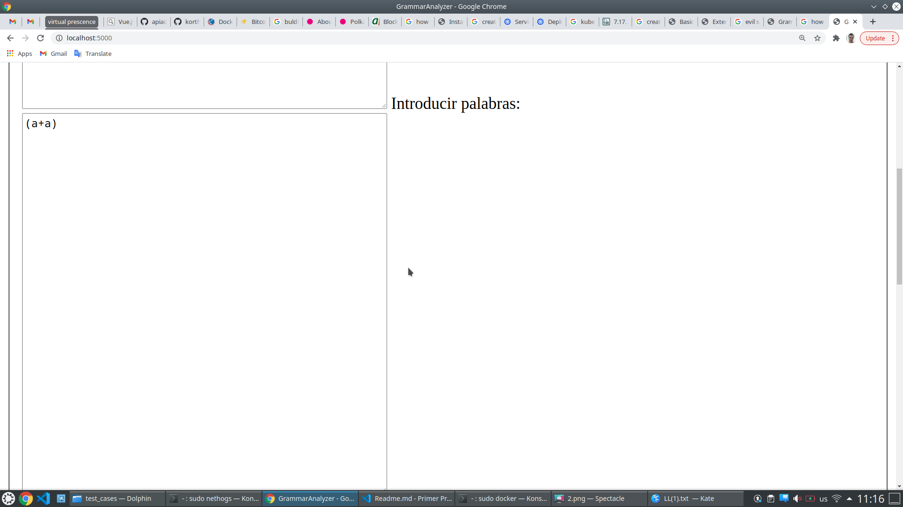

# About

This project is about a grammar analyzer. The idea is to show properties of input grammars. We analyze *[first][1]* and *[follows][1]* of the grammar, the *[productions][2]*, *[terminals and no terminals][3]*, analyzed if the *[grammar is regular][4]* or not, transform to *[Chomsky Normal Form][5]*, showed *[parsing table][6]*, delete inmediate *[left recursion][7]*, showed reduce-reduce or shift-reduce conflicts, showed *[derivation tree][8]* of words, and others. Many code from solved exercises in Compiler Theory course was used. The code for create LALR tables was created used [PLY][9] framework.

[1]: https://www.geeksforgeeks.org/why-first-and-follow-in-compiler-design/
[2]: https://en.wikipedia.org/wiki/Production_(computer_science)
[3]: https://en.wikipedia.org/wiki/Terminal_and_nonterminal_symbols
[4]: https://en.wikipedia.org/wiki/Regular_grammar
[5]: https://en.wikipedia.org/wiki/Chomsky_normal_form
[6]: https://en.wikipedia.org/wiki/Parse_table
[7]: https://en.wikipedia.org/wiki/Left_recursion
[8]: https://en.wikipedia.org/wiki/Parse_tree
[9]: https://pypi.org/project/ply/

## More

See in this repository:

- `orden.pdf`

# Requirements

- Docker

# How to execute

1. Build image `sudo docker build ./ -t rayniel95/grammaranalyzer:v1.0`
2. Execute container `sudo docker run --network "host" rayniel95/grammaranalyzer:v1.0`

# How to use

1. Conect to `localhost:5000`
2. Introduce `/usr/bin/dot` as path at:

3. Play with test cases in `code/test_cases`. You can find differents grammars and words.

> Note: For update automaton visualization press `Ctrl + R`.
